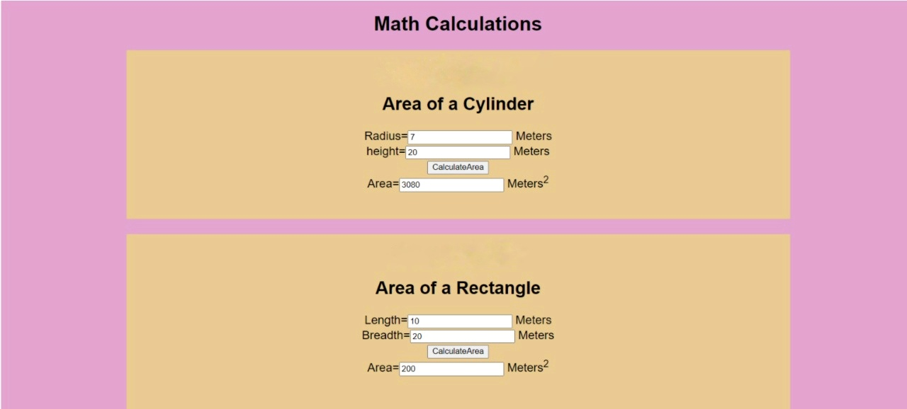

# AngularCalculation

# Web Page for Mathematical Calculations using Angular

## AIM:
To design a dynamic website to perform mathematical calculations using Angular Framwork

## DESIGN STEPS:

### Step 1:

Requirement collection.

### Step 2:

Creating the layout using HTML and CSS in component.html file

### Step 3:

Write typescript to perform the calculations.

### Step 4:

Validate the layout in various browsers.

### Step 5:

Validate the HTML code.

### Step 6:

Publish the website in the given URL.

## PROGRAM :
## app.component.html:
~~~

<body>
    

    <h1>Math Calculations</h1>
    

        <Cylinder-Area class="formelement"></Cylinder-Area>
    

    

        <Rectangle-Area class="formelement"></Rectangle-Area>
    

    

        Developed by Harikrishna 
    

    

</body>
~~~
## app.module.ts:
~~~
import { NgModule } from '@angular/core'; import { FormsModule } from '@angular/forms'; import { BrowserModule } from '@angular/platform-browser';

import { AppComponent } from './app.component'; import { cylinderComponent } from './cylinder/cylinder.component'; import { RectangleComponent } from './rectangle/rectangle.component';

@NgModule({ declarations: [ AppComponent,RectangleComponent,cylinderComponent ], imports: [ BrowserModule,FormsModule ], providers: [], bootstrap: [AppComponent] }) export class AppModule { }
~~~
##cylinder.component.html:
~~~

    <h2>Area of a Cylinder</h2>
    Radius=<input type="text" [(ngModel)]="radius"> Meters 
    height=<input type="text" [(ngModel)]="height"> Meters 
       <input type="button" (click)="onCalculate()" value="CalculateArea"> 
    Area=<input type="text" [value]="area"> Meters2 

~~~
## cylinder.component.ts:
~~~
import { Component } from "@angular/core";

@Component({
    selector:'Cylinder-Area',
    templateUrl:'./cylinder.component.html'
})
export class cylinderComponent{
    radius:number;
    height:number;
    area:number;
    constructor(){
        this.radius=10;
        this.height=20;
        this.area= this.radius * this.height;
    }
    onCalculate(){
        this.area =(22/7)* this.radius*this.radius * this.height
    }
}
~~~
## rectangle.component.html:
~~~

    <h2>Area of a Rectangle</h2>
    Length=<input type="text" [(ngModel)]="length"> Meters 
    Breadth=<input type="text" [(ngModel)]="breadth"> Meters 
       <input type="button" (click)="onCalculate()" value="CalculateArea"> 
    Area=<input type="text" [value]="area"> Meters2 

~~~
## rectangle.component.ts:
~~~
import { Component } from "@angular/core";

@Component({
    selector:'Rectangle-Area',
    templateUrl:'./rectangle.component.html'
})
export class RectangleComponent{
    length:number;
    breadth:number;
    area:number;
    constructor(){
        this.length=10;
        this.breadth=20;
        this.area= this.length * this.breadth;
    }
    onCalculate(){
        this.area = this.length * this.breadth
    }
}
~~~

## OUTPUT:

## Result:
Thus the program to create the angular calculation using Angular is completed successfully.
